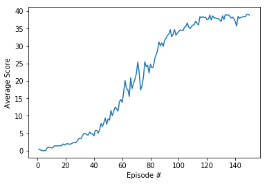

## Project 2 Continious Control

### Introduction
In this project, the Unity Reacher environment which is a double jointed arm that can move in different directions. The agent receives a reward of +0.1 when it is in the goal location, so the goal is to stay there for as long as possible.

The observation space consists of 33 variables corresponding to the position, rotation, velocity, and angular velocities of the arm. Each action is a vector with four numbers, corresponding to torque applicable to two joints. Every entry in the action vector should be a number between -1 and 1.

This project has two modes, single agent and 20-agents. I have worked on the multi-agent version of the project, where in order to finish the average score of all the agents over the last 100 consecutive episodes must be equal or higher than +30.

### DDPG
The Deep Deterministic Policy Gradient (DDPG) algorithm which is an "actor-critic" method is used for training the agent. However, after several experimental runs, the following modifications are added to the algorithm for better performance.

* Both actor and critic models have 256 and 128 hidden nodes.
* The Batch size is changed to 256 to include more samples.
* The actor and critic learning rates are changed to 0.0001.
* The noise added to action for exploration is reduced gradually as the agents' learning is improved.
* Based on the recommendation of the course and to stabilize the learning process, the agents are trained 10 times in every 20 steps.

### Simulation Results
Once these improvements are implemented, the agents are trained and the average rewards results are shown below. As it can be seen the environment is solved after 50 episodes.

The same model and agent were tested for the single agent mode, and the results showed that learning is much slower compared to the 20 agent mode due to the large variety of actions while in the multi-agent mode, the experiences are shared which leads to faster learning.

### Further Improvements

Batch normalization is one approach which can improve learning by adding randomness to the hidden nodes.

Also, using algorithms such as PPO, A3C, and D4PG which use multiple (non-interacting, parallel) copies of the same agent to distribute the task of gathering experience.